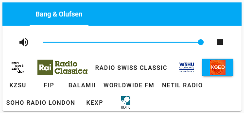
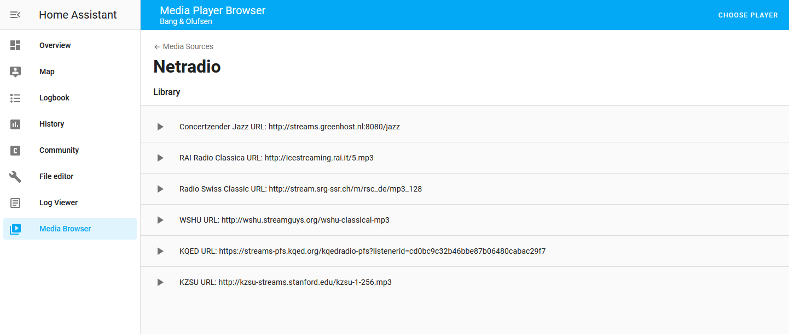
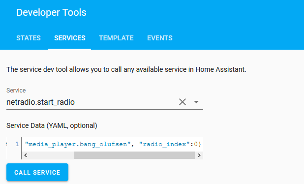

# NetRadio component for Home Assistant

This is a new Media_source for the Home Assistant home automation framework, that allows you to define a set of web radio stations (e.g., http://streams.greenhost.nl:8080/jazz) and then play them from a service call or by using a custom Lovelace card.


### To install the Media Source component:
1. Create a netradio folder inside the config/custom_components folder
2. Copy \_\_init__.py, const.py, manifest.json, media_source.py, services.yaml to config/custom_components/netradio
3. Add a configuration in your configuration.yaml file like this. 
* URL is the link to the audio stream. 
* Name is the user friendly name. 
* Icon is a link to a thumbnail image that will be shown in the browser.

```
netradio:
  radios: 
    - url: 'http://streams.greenhost.nl:8080/jazz'
      name: Concertzender Jazz
    - url: 'http://icestreaming.rai.it/5.mp3'
      name: RAI Radio Classica
      icon: 'https://cdn-profiles.tunein.com/s17167/images/logoq.png?t=153677'
    - url: 'http://stream.srg-ssr.ch/m/rsc_de/mp3_128'
      name: Radio Swiss Classic
    - url: 'http://wshu.streamguys.org/wshu-classical-mp3'
      name: WSHU
    - url: 'https://streams-pfs.kqed.org/kqedradio-pfs?listenerid=cd0bc9c32b46bbe87b06480cabac29f7'
      name: KQED
    - url: 'http://kzsu-streams.stanford.edu/kzsu-1-256.mp3'
      name: KZSU
```  

You can find a lot of network radios in directories like this one: https://www.radio-browser.info/


### To install the Custom Lovelace card (optional):



1. Copy netradio-card.js to <config>/www directory
2. Add netradio-card.js to your Lovelace resources (you need to activate advanced mode first), by going to Configuration->Lovelace Dashboards ->Resources->Add resource
3. add "/local/netradio-card.js" as a Javascript Module
4. Add the card in your Lovelace UI by using the following configuration example (replace your media player name):
  
```
type: 'custom:netradio-card'
entities:
  - media_player.bang_olufsen
```


## How to use

You can play the radios from the Custom Lovelace Card, the Media Browser panel, or by calling a service:

### Media browser



### Service calls

There are three service calls

__netradio.start_radio__

Starts playing a given radio station, with parameters:

```
entity_id - the media player to play the radio
radio_index - the number of the radio you want to play, starting from 0, in the list above.
```




__netradio.next_radio__

Switches to the next radio in the list. Goes back to the first radio when you switch past the last one in the list.

{"entity_id": "media_player.bang_olufsen"}


__netradio.prev_radio__

Switches to the previous radio in the list.

{"entity_id": "media_player.bang_olufsen"}

** Handling Slow Start Time with Chromecast

If you use chromecast as a media player for your radios, you may experience that some streams take a long time to start playing (up to 30 seconds or more). [This is a bug in the Chromecast that they've not fixed despite many bug reports](https://stackoverflow.com/questions/52504992/google-cast-slow-for-some-streams). However there is a workaround: after starting the radio with the __netradio.start_radio__ service, wait 2 or 3 seconds and then call the __media_player.media_play__ service, as shown below. That will kick the Chromecast to actually start playing immediately.


